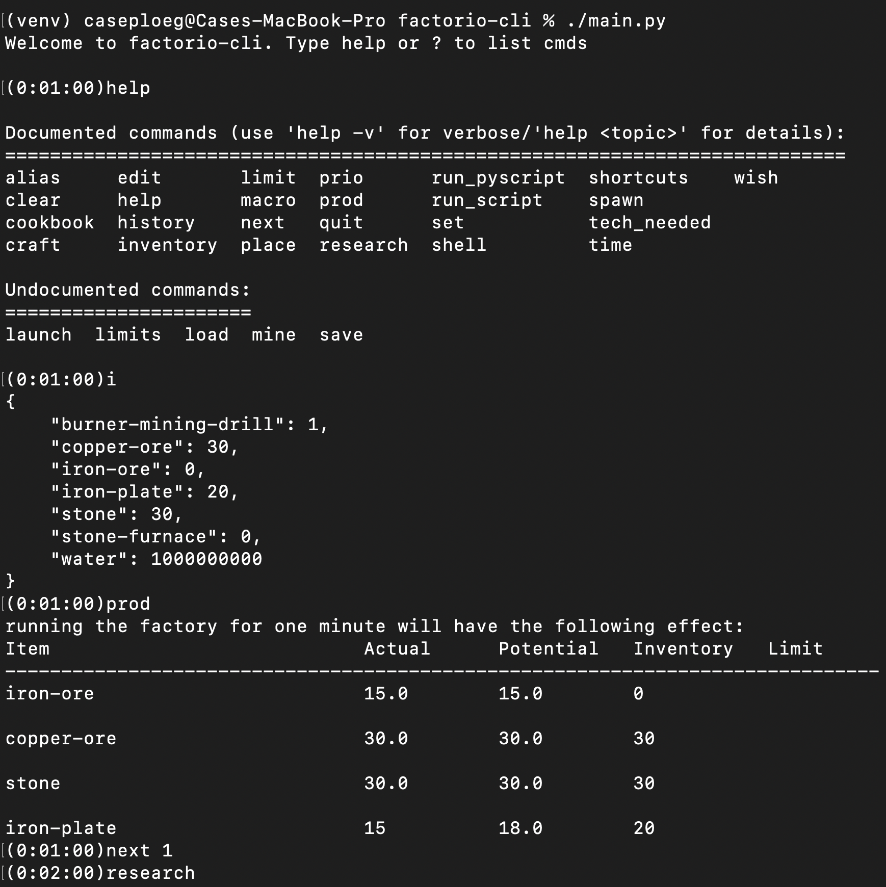

# factorio-cli




Simulate 10 hours of gameplay in < 1 minute on the command line.

The factorio-cli is text-based software for planning speedruns for the game factorio. It can also be understood as turn-based factorio where each in-game action has been abstracted into a text command. 

## simulation features
- inventory system
- mine resources
- craft items
- research technology
- place machines that automate crafting and mining
- track automated production statistics
- limit production of specific items
- launch rockets
- import/export game state 

## project structure
sim.py <- server.py <- client.py <- shell.py

- sim.py , game simulation 
- server.py , web server (runs the simulation in memory, exposes API)
- client.py , service client 
- shell.py , CLI interface 

## testing
`./run_tests.sh`

This project is using an end-to-end testing strategy to avoid unwanted breaking changes. Factorio-cli is a deterministic system, so running the same commands on different versions of source-code should produce the same save file as long as no breaking changes were made. Tests are composed of script files + the expected save file. These tests are easy to create and cover real use cases.

## project goals
- improve the simulation by abstracting more game features
- write cool software on top of the simulation 
    - bots
    - visuals
    - multiplayer 

## dependencies
- [cmd2](https://github.com/python-cmd2/cmd2) for the cli 
- [Data Exporter to JSON](https://mods.factorio.com/mod/recipelister) mod by Erythion for data extraction
- [flask](https://flask.palletsprojects.com/en/3.0.x/)


## local setup 
https://www.b-list.org/weblog/2022/may/13/boring-python-dependencies/
```
python3 -m venv venv
source venv/bin/activate
pip install -r requirements.txt 
source ./setupdevenv.sh
flask --app server run
python3 ./main.py
```
